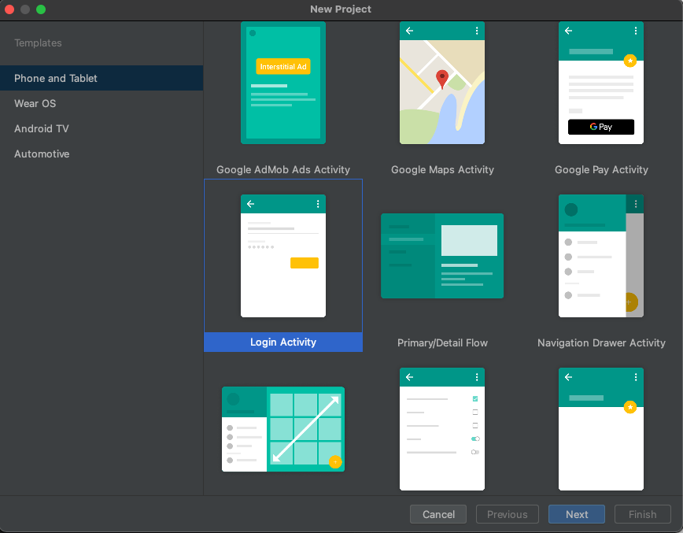

# Welcome to Espresso Kotlin Playground

## What is this? 

A mini series on the different strategies from playing around with [Espresso](https://developer.android.com/training/testing/espresso) and [Kotlin](https://kotlinlang.org/) to help accelerate the development of writing expressive tests. 

## How to read

The series of topics was intended to be read sequentially to continuously build off the topics being covered. So if you came in at a random place and don't understand the subject, it might help to start from the beginning at the [page object pattern](https://plusmobileapps.com/espresso-kotlin-playground/page-object-pattern).

## What you will learn 

* [Page Object Pattern](https://plusmobileapps.com/espresso-kotlin-playground/page-object-pattern) - abstract out the logic of interacting with a page in the UI from the test
* [Espresso Extensions](https://plusmobileapps.com/espresso-kotlin-playground/espresso-extensions) - a collection of [Kotlin extension functions](https://kotlinlang.org/docs/extensions.html) that help reduce some of the boiler plate in view matching/interactions and provide better code completion when building out page objects
* [Navigation DSL](https://plusmobileapps.com/espresso-kotlin-playground/navigation-dsl) - create a domain specific language for navigating between the different page objects in a test
* Mock Tests
    * [Mockk Test](https://plusmobileapps.com/espresso-kotlin-playground/mockk-test) - write a test with a mocked dependency using [Mockk](https://mockk.io/)
    * [Mock Ktor Test](https://plusmobileapps.com/espresso-kotlin-playground/mock-ktor-test) - write a mock network test using [Ktor](https://ktor.io/) network client and [Mock Engine](https://ktor.io/docs/http-client-testing.html). Also learn how to use [Espresso idling resources](https://developer.android.com/training/testing/espresso/idling-resource) to deal with code that runs on the IO thread and can cause flaky tests. 

## Onward

I hope you learn something from this series and please leave any comments about the series on my website. If there's any suggestions to improve anything, feel free to [open up a issue](https://github.com/plusmobileapps/espresso-kotlin-playground/issues/new) on the project. Otherwise, enjoy! 

!!! info
    If you are trying to follow along with your own code, download [Android Studio](https://developer.android.com/studio/preview) Bumblebee and create a new project with the Login Activity template. This will provide a basic template to build off for the duration of the project. 
    
