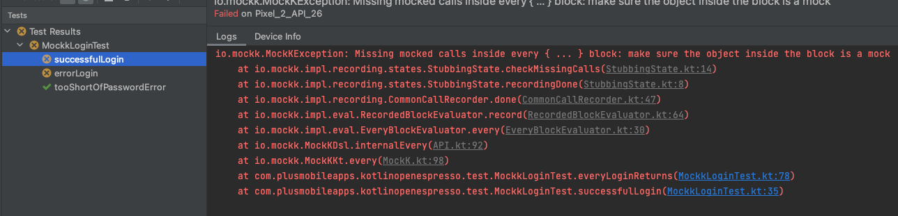

# Mockk Test

* [Add hilt to the app commit](https://github.com/plusmobileapps/espresso-kotlin-playground/commit/cd65d50fea1760c966f6ba7f571bf2cdcd26592a)
* [Add mockk and error test commit](https://github.com/plusmobileapps/espresso-kotlin-playground/commit/f9e55f2b8f0f8c6bddf0a4158e6d463df9d668fb)

## Pre Android Pie (API 28) mocking

Up until this point the app will run fine on Android P and above, however there are some limitations to Mockk mocking final classes in Espresso before that. Running the test on an emulator lower than API 28 will result in the following error caused by the `everyLoginReturns {}` function. 

If you are writing an Android app that has a minimum SDK less than Android P and need to mock a final class in a test. The recommended approach on the [Mockk Android](https://mockk.io/ANDROID.html) page is to use [Dexopener](https://github.com/tmurakami/dexopener), however if you look on the project readme you will see: 

!!!quote
    DexOpener will do the following things at runtime:

    1. Remove the final modifier from the classes belonging to the specified package
    2. Create dex files to make the application class loader load those classes

    However, they are not so lightweight. If you would like to save even a little testing time of your Kotlin app, you can introduce [the all-open compiler plugin](https://kotlinlang.org/docs/reference/compiler-plugins.html#all-open-compiler-plugin) instead of DexOpener.

So to keep the mock tests as performant as possible we will use the [Kotlin all open compiler](https://kotlinlang.org/docs/all-open-plugin.html) which will only open up classes marked with an annotation on debug builds. 

* [Add Kotlin all open compiler commit](https://github.com/plusmobileapps/espresso-kotlin-playground/commit/8c2bbe3ba0d167d8eb8f8d02d6fee3caa263681d)

## Source

[github commit](https://github.com/plusmobileapps/espresso-kotlin-playground/commit/959b7b62136a498d35b3c72ec0206da93794a931)