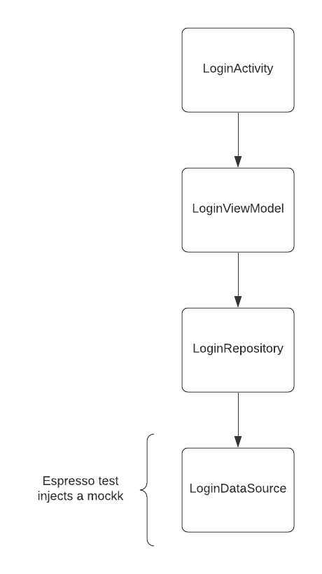

# Mockk Test

## Pre Android P mocking

If you are writing an Android app that has a minimum SDK less than Android P and need to mock a final class in a test. The recommended approach on the [Mockk Android](https://mockk.io/ANDROID.html) page is to use [Dexopener](https://github.com/tmurakami/dexopener). Although there is one other approach recommended by the creator of Dexopener to use the [Kotlin all open compiler](https://kotlinlang.org/docs/all-open-plugin.html) which will only open up classes marked with the annotation on debug builds. 
