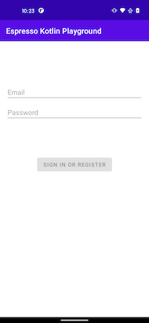
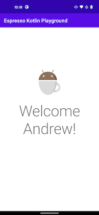

# Navigation DSL 

Writing Espresso tests with the page objects so far has helped in code readability and maintainability. To help accelerate writing the tests in the app, a navigation domain specific language (DSL) can be made to help navigate and make assertions on the current screen in a test. 

!!! info 
    To build the navigation DSL, it will help to have a basic understanding of [higher order functions](https://kotlinlang.org/docs/lambdas.html#higher-order-functions) and [function literals with receiver](https://kotlinlang.org/docs/lambdas.html#function-literals-with-receiver) to better understand how the [type safe builders](https://kotlinlang.org/docs/type-safe-builders.html) in the DSL are being made. 

## Simple DSL 

Considering the two pages in the app, the first method to navigate would be from the `LoginPage` to the `LoggedInPage`. 

| LoginPage | LoggedInPage |
| ---------- | ------------ |
|  |  |

The simplest way to implement a navigation method on a page object would be to make use of some `.apply { }` blocks. 

```kotlin
class LoginPage : BasePage {
    fun goToLoggedInPage(block: LoggedInPage.() -> Unit): LoggedInPage {
        onSignInOrRegisterButton().click()
        return LoggedInPage().apply {
            assertScreen()
            block()
        }
    }
}
```

Then a simple test could look like this: 

```kotlin
@Test fun successfulLogin() {
    LoginPage().apply { 
        assertScreen()
        enterInfo(username, password)
    }.goToLoggedInPage { 
        onBodyText().verifyText("Welcome Andrew!")
    }
}
```

This simple test is a good start in the DSL, however there are a few areas of improvement. 

* every navigation function parameter will have duplication to declare the function literal with a receiver on the navigated to page object
* the navigation function is verbose to always click a button, assert the screen was navigated to, then apply the lambda to its receiver
* the first screen in the test will always be asserting the screen and a lambda with a receiver on that page

## PageScope 

To simplify the function parameter of a navigation function and reduce the need to always declare it as a lambda with a receiver. Creating a [type alias](https://kotlinlang.org/docs/type-aliases.html) with a generic can help simplify the function parameter declaration. 

```kotlin
typealias PageScope <T> = T.() -> Unit
```

Now the navigation function can be declared with the following syntax. 

```kotlin
class LoginPage : BasePage {
    fun goToLoggedInPage(block: PageScope<LoginPage>): LoggedInPage {}
}
```

## Navigate click helper

Most navigation methods typically happen in the following order. 

1. some click on the screen 
2. instantiate the page object being navigated to 
3. assert screen navigated to is showing 
4. apply the `PageScope` to the page so any interaction from the test can occur

To help make writing a click navigation function easier, an extension function on `BasePage` that takes the view being clicked on and the `PageScope` as a parameter. 

```kotlin
inline fun <reified T : BasePage> BasePage.navigateToPageWithClick(
    viewInteraction: ViewInteraction,
    block: PageScope<T>
): T {
    viewInteraction.click() // 1
    return T::class.java.newInstance().apply { // 2
        assertScreen() // 3
        block() // 4
    }
}
```

Now the navigation method can be simplified to the following: 

```kotlin
class LoginPage : BasePage {
    fun goToLoggedInPage(block: PageScope<LoggedInPage>): LoggedInPage =
        navigateToPageWithClick(onSignInOrRegisterButton(), block)    
}
```

## Start navigation

The start of every test instantiates a new page object and asserts that the screen was show before applying the `PageScope`. To simplify this task, some logic from the click helper function can be reused. 

```kotlin
inline fun <reified T : BasePage> startOnPage(block: PageScope<T> = {}): T =
    T::class.java.newInstance().apply {
        assertScreen()
        block()
    }
```

## Navigate without interaction

It may be possible that a test will need to navigate to a screen but not interact with that page. So it would be desired to continue navigation without needing to supply another lambda which is simple by using a default argument as an empty lambda in the navigation function. 

```kotlin
class LoggedInPage : BasePage {

    fun goToSettings(block: PageScope<Settings> = {}): SettingsPage = 
        navigateToWithClick(onSettings(), block)

}
```

## DSL Structure

Putting everything together, the basic of the structure of the navigation DSL would have a test looking like the following: 

```kotlin
@Test fun successfulLogin() {
    startOnPage<LoginPage> { // start navigation 
        // this: LoginPage
        // interact with screen
        enterInfo(username, password)
    }.goToLoggedInPage { // chained methods navigate to another screen
        // this: LoggedInPage
        // or make assertions
        onBodyText().verifyText("Welcome Andrew!")
    }.goToSettings() // default empty scoped lambda can assert navigation to a screen but not interact
}
```

* Navigation is done with `startOnPage()` or a function in a page object, which should provides a scoped lambda to the page
* Each navigation function also returns the page being navigated to in order to chain navigation methods after scoped lambdas
* View interactions and assertions occur inside of each scoped lambda with the page as its receiver
* Any `PageScope` function parameter should provide a default empty lambda so navigation can be asserted, but not require interaction with a screen. 
