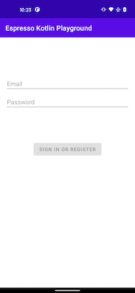

# Page Object Pattern

The page object pattern is a very popular design pattern when writing automation tests for minimizing code duplication and test code that is easy to maintain. 

## What is a page object

A page object is an object oriented class that is an abstraction over the user interface for an automation test. 

## How to make a page object

!!! quote
    The basic rule of thumb for a page object is that it should allow a software client to do anything and see anything that a human can. It should also provide an interface that's easy to program to and hides the underlying widgetry in the window.

    -[Martin Fowler](https://martinfowler.com/bliki/PageObject.html)

Using the rule above, what might be some objects that a user could interact with on each page below? 

| LoginPage | LoggedInPage |
| ---------- | ------------ |
|  |  |

??? answer
    **LoginPage**

    * email 
    * password
    * sign in or register button

    **LoggedInPage**
    
    * profile image
    * greeting text

### BasePage

To start building these page objects, first define an interface that will provide one simple function to assert the screen is visible. This will be essential for the [navigation DSL](https://plusmobileapps.com/espresso-kotlin-playground/navigation-dsl/) later. 

```kotlin
interface BasePage {

    fun assertScreen()

}
```

The rest of the page objects may be implemented using the `BasePage`. Since Espresso is being used to write the tests, every object on each page shall return a [`ViewInteraction`](https://developer.android.com/reference/androidx/test/espresso/ViewInteraction) to provide tests an interface for interacting with views.  

### LoginPage

```kotlin
class LoginPage : BasePage {

    override fun assertScreen() = TODO()

    fun onEmail(): ViewInteraction = TODO()
    fun onPassword(): ViewInteraction = TODO()
    fun onSignInOrRegisterButton(): ViewInteraction = TODO()

}
```

### LoggedInPage

```kotlin
class LoggedInPage : BasePage {

    override fun assertScreen() = TODO()

    fun onWelcomeGreeting(): ViewInteraction = TODO()
    fun onProfileImage(): ViewInteraction = TODO()
    
}
```

## Simple Test

With each page object defined, a successful login test can be written using some Espresso [`ViewActions`](https://developer.android.com/reference/androidx/test/espresso/action/ViewActions) to type in the login info and verify the user name after a successful submission. 

```kotlin
@Test 
fun successfulLogin() {
    val scenario = ActivityScenario.launch(LoginActivity::class.java)

    LoginPage().apply {
        onEmail().perform(ViewActions.typeText("andrew@test.com"))
        onPassword().perform(ViewActions.typeText("password123"))
        onSignInOrRegisterButton().perform(ViewActions.click())
    }

    LoggedInPage().onWelcomeGreeting().check(matches(withText("Welcome Andrew!")))

}
```

As you probably have noticed, none of the functions in the page object have been implemented and the test above is a little verbose. Move onto the next section to learn about some helpful extension functions that simplify implementing the rest of the page object and make the test more expressive. 

## Resources

* Source code
    * [Github Commit](https://github.com/plusmobileapps/espresso-kotlin-playground/commit/241fa65658864c45cfbce8757de21ab7eb0f3c09)
    * [`2-page-objects` - GitHub branch](https://github.com/plusmobileapps/espresso-kotlin-playground/tree/2-page-objects)